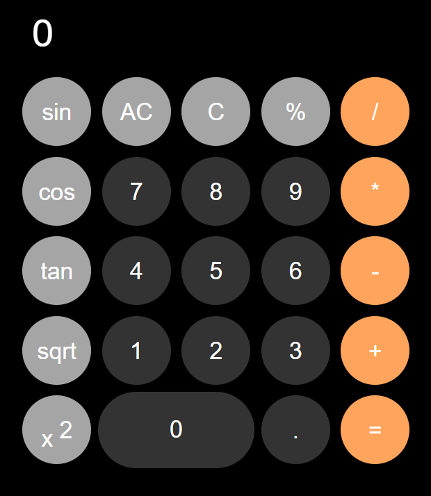

# 🧮 Simple Calculator

A basic calculator web application built with **HTML, CSS & JavaScript** — ideal for quick arithmetic operations, learning JavaScript DOM manipulation, or as a foundation for more complex projects.

---

## ✨ Features

- ✅ Addition, subtraction, multiplication, and division  
- ✅ Clean, minimal design and user-friendly interface  
- ✅ Works in any modern browser — no build tools required  
- ✅ Easy to extend (e.g. add more operations, UI improvements, keyboard support)

---

## 📸 Preview
 

